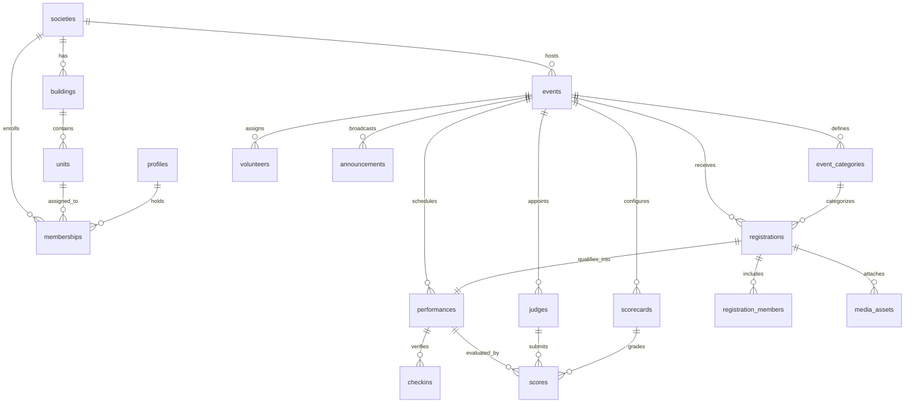

# SocietyStage 🎭

> **Multi-Tenant Cultural Event & Live Stage Operations Platform for Residential Housing Societies**

SocietyStage is a production-ready application specifically engineered for residential apartment complexes and gated societies. It bridges the entire cultural event lifecycle: from multi-tenant member onboarding and participant act submissions with audio track uploads, through audition review, automated lineup pacing, real-time backstage check-ins, live countdown timers, stage cues, and projector/TV display modes.

---

## 🌟 Key Features

1. **Multi-Tenant Society Isolation**:
   - Each residential society is an isolated tenant (`societies`, `buildings`, `units`, `memberships`).
   - Dynamic role-based permissions (`society_admin`, `stage_manager`, `event_manager`, `volunteer`, `judge`, `resident`).
   - Row Level Security (RLS) policies on all 24 Postgres tables with security definer functions.

2. **End-to-End Cultural Event Workflow**:
   - **Event Creation Wizard**: 6-step wizard configuring categories (Dance, Vocal, Instrumental, Drama, Fashion Show), AV equipment requirements, and rules.
   - **Resident Experience**: 6-step registration stepper supporting solo acts, group troupes, roster member management, minor parental consent, and MP3/WAV soundtrack uploads.
   - **Committee Review Suite**: 2-column evaluation interface with built-in audio audition player, photo verification, and status updates (`approved`, `changes_requested`, `rejected`).
   - **Lineup & Run-Order Builder**: Sequential runtime computation, transition buffers, conflict detection, category pacing auto-scheduler, and schedule locking.
   - **Live Command Center (`/events/[id]/live`)**: High-contrast operator station featuring live elapsed/remaining countdown timers with overtime detection, state transitions (`QUEUED → CHECKED_IN → READY → ON_STAGE → COMPLETED`), emergency delays, skip, and stage broadcast cues.
   - **Projector & Big TV Display Mode (`/events/[id]/display`)**: Zero-clutter public stage view with live digital clock, "Now Playing", "Next in Wings", Intermission, Announcements, and Fullscreen toggle.
   - **Jury & Volunteer Modules**: Dedicated volunteer backstage check-in gate and judge scorecard rubrics with anti-duplicate locks.
   - **Security & Auditing**: Immutable audit logging of administrative changes, state transitions, approvals, and CSV reporting exports.

---

## 🏗️ Architecture & Technology Stack

| Layer | Technology |
|---|---|
| **Framework** | Next.js (App Router, Turbopack, React 19) |
| **Language** | TypeScript (Strict type safety) |
| **Styling** | Tailwind CSS + Custom Cultural Jewel-Tone Theme + Glassmorphism |
| **Database & Auth** | Supabase (PostgreSQL 15+, Supabase Auth, Row Level Security) |
| **Storage** | Supabase Storage (Private controlled buckets with size & MIME limits) |
| **Realtime** | Supabase Realtime + Multi-tab BroadcastChannel sync |
| **Validation** | Zod schemas |
| **Components** | Lucide React, Sonner (Rich Toasts), Canvas Confetti |
| **Testing** | Vitest (11 passing tests across multi-tenancy, RBAC, state transitions) |

---

## 📐 Database Entity Relationship Diagram (ERD)



---

## 🗂️ Application Route Map

| Route | Viewpoint / Description |
|---|---|
| `/` | Landing page showcasing the 7-stage workflow and quick role launchers |
| `/admin` | Admin KPI dashboard, next event countdown, and recent submissions |
| `/admin/events` | Festival list with status lifecycle controls (`draft` → `published` → `live`) |
| `/admin/events/new` | 6-step event creation wizard with category and form configurator |
| `/admin/participants` | Submissions table with filters, search, and 2-column audition modal |
| `/admin/lineup` | Run-order scheduler with drag/arrow reordering and auto-scheduling |
| `/admin/volunteers` | Volunteer duty assignments and backstage check-in gate |
| `/admin/judges` | Scoring rubrics, performance grading, and anti-duplicate locks |
| `/admin/reports` | Summary analytics, attendance turn-out, and CSV export |
| `/admin/members` | Society buildings/towers, flats, and resident role invitations |
| `/admin/audit` | Security audit trail with before/after state diff inspector |
| `/admin/settings` | Society profile details and private storage upload limits |
| `/events/[id]/live` | High-contrast Live Command Center with countdown timer & audio player |
| `/events/[id]/display` | Stage Display Mode for TV/Projectors with 6 visual layouts |
| `/resident` | Resident portal home with active act spotlight and announcements |
| `/resident/events` | Cultural event catalog with registration status filters |
| `/resident/events/[id]` | Event details, categories, rules, and [ Participate ] CTA |
| `/resident/events/[id]/register` | 6-step registration wizard with audio upload and minor consent |
| `/resident/my-participation` | Performer cards showing scheduled slots, audio player, and call time |
| `/resident/notifications` | In-app activity stream and stage call notifications |
| `/resident/profile` | Resident details, flat assignment, and role switcher |

---

## 🔑 Demo Credentials & Quick Role Switcher

The application includes an instant **Role Switcher** banner at the very top of every screen to test any viewpoint without logging in and out:

| Role | Demo Account | Permissions |
|---|---|---|
| **Society Admin** | `admin@greenvalley.demo` | Full event creation, approvals, lineup management & audit logs |
| **Stage Manager** | `stage@greenvalley.demo` | Live command center, timer controls, cue calls, emergency delays |
| **Volunteer** | `volunteer@greenvalley.demo` | Gate check-in, backstage readiness verification |
| **Judge** | `judge@greenvalley.demo` | Category scorecards and performance comments |
| **Resident** | `resident@greenvalley.demo` | Participant registration, soundtrack uploads, scheduled slot viewer |

*Demo Password for all seeded accounts:* `AdminPass123!`

---

## 🚀 Quickstart & Local Setup

### 1. Install Dependencies
```bash
npm install
```

### 2. Configure Environment Variables
Copy `.env.example` to `.env.local`:
```bash
cp .env.example .env.local
```

### 3. Run Test Suite
```bash
npm test
```
All 11 unit and integration tests will run with Vitest:
- Multi-tenant data isolation
- Registration validation and minor parental consent
- Admin approvals and lineup addition
- Sequential schedule time calculations
- Live stage state transitions validation
- Gate check-ins
- Judge scoring and duplicate prevention

### 4. Run Development Server
```bash
npm run dev
```
Open [http://localhost:3000](http://localhost:3000) in your browser.

---

## 🗄️ Supabase Deployment & Database Migrations

To apply migrations directly to a live Supabase PostgreSQL instance:

1. Link or configure your Supabase CLI:
   ```bash
   npx supabase login
   npx supabase link --project-ref <your-project-ref>
   ```

2. Run migrations in sequential order:
   - `supabase/migrations/00001_initial_schema.sql` (Creates 24 tables, indexes, triggers)
   - `supabase/migrations/00002_rls_policies.sql` (Enables RLS on all tables and RBAC functions)
   - `supabase/migrations/00003_storage_buckets.sql` (Creates 5 storage buckets and policies)
   - `supabase/migrations/00004_seed_demo_data.sql` (Seeds Green Valley Residency & Cultural Night)

3. Alternatively, copy and execute the SQL files in your **Supabase Dashboard SQL Editor**.

---

## 🔒 Storage Architecture & Security

Private Supabase Storage buckets configured:
- `participant-photos` (Max: 10MB, Images only)
- `event-media` (Max: 50MB, Event posters and brochures)
- `performance-audio` (Max: 50MB, MP3/WAV/AAC soundtracks)
- `performance-video` (Max: 250MB, MP4 rehearsal recordings)
- `documents` (Max: 20MB, PDF rules and score sheets)

All uploaded media is restricted by Row Level Security so only authorized society members, performers, and stage committee managers can access or download files.

---

## 🏆 Acceptance Criteria Verification

The application satisfies the complete 35-point end-to-end workflow:
1. Admin signs in / selects society ("Green Valley Residency").
2. Admin creates society or modifies settings.
3. Admin adds buildings (Tower A, B, C) and flats.
4. Admin invites resident members with designated roles.
5. Resident views cultural festivals.
6. Resident opens event and inspects categories/rules.
7. Resident completes 6-step registration wizard.
8. Resident adds performers, minor parental consent, and special AV requirements.
9. Resident uploads audio track (MP3) and costume photo.
10. Admin inspects submission in 2-column review modal.
11. Admin listens to audio audition and approves submission.
12. Admin adds approved act into official stage lineup.
13. Admin reorders lineup run-order; timings recalculate automatically.
14. Stage manager opens Live Command Center (`/events/[id]/live`).
15. Volunteer checks troupe in backstage.
16. Stage manager moves act to READY in wings.
17. Stage manager launches performance to ON_STAGE; live countdown clock runs.
18. Performance completes and system queues next act.
19. Public projector/TV display mode updates in real-time.
20. Audit log records all mutations and reports export to CSV.
21. Refreshing browser preserves full state via persistent database store.
